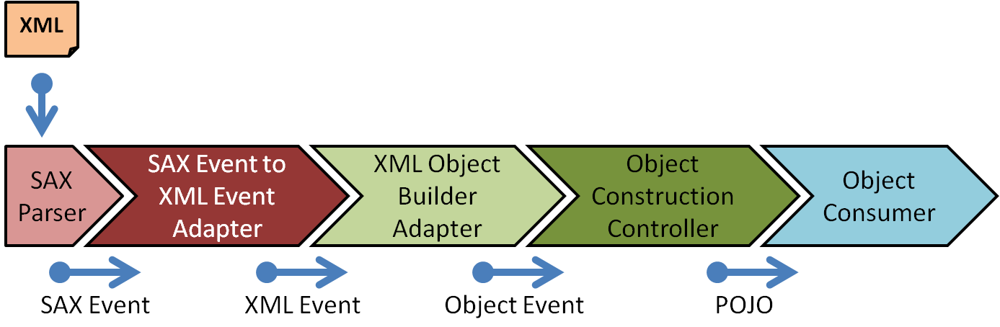
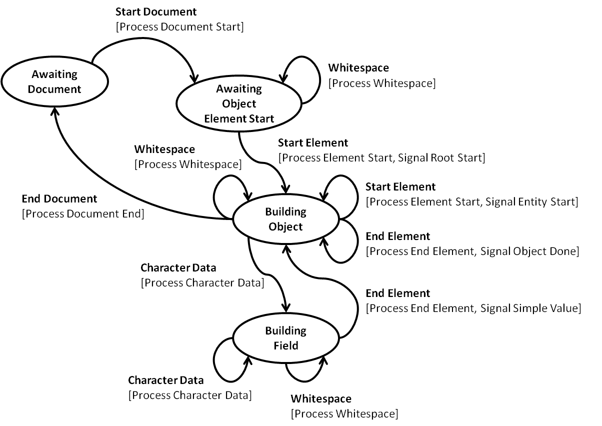
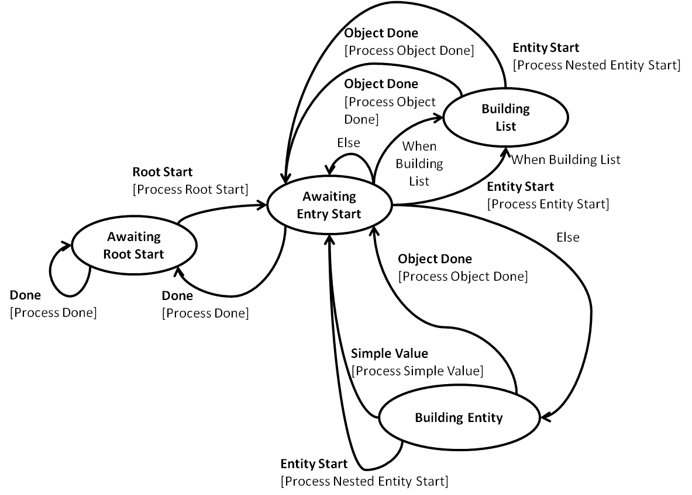

# State Table Utility

The State Table Utility makes it easy to implement state machines that do work as they transition between discrete states based on events.  This utility may be distinguished from others available elsewhere by these points:

* It is focused on transforming data where the data object is a first-class element of the construct
* It more closely resembles a Mealy State Machine than a UML or Moore State Machine (see [Finite-State Machine](https://en.wikipedia.org/wiki/Finite-state_machine)) in that there is only one transition triggered from the arrival of an event and the actions performed are done on the transition rather than on the entry or exit to or from a state
* It has very few constructs to favor simplicity rather than a lot of constructs that try to encapsulate more of the processing inside the state table model

State machines are good for a few different kinds of use cases that are all naturally driven by events.  Over the course of my career I have implemented state tables to support

* an implementation of the Kerberos authentication algorithm
* an order management system for a pharmaceutical equipment market place
* a terminal emulator
* an XML Parser based on the SAX Parser

They can serve will in software systems that control mechanical devices and in controllers supporting an interactive user interface.  They also work well in parsers as you will see below.

Because state tables employ a higher level of abstraction than common procedural code, they can make highly event-driven and asynchronous software more reliable (with fewer defects).  Perhaps the biggest downside is that the developer needs to think a little differently when creating solutions that use state tables.

When you are writing code where there exists in the underlying domain some set of natural states for the system and you find you have a lot of nested `if` statements, then you might consider employing a state table approach to make sure you are not missing some condition in some state.  This approach makes it easier to make sure you are covering all your bases.

## Turnstile State Table Example

Perhaps the best way to explain what state tables can do is by presenting a simple example.  Let's take a look at how a state table might be used to control a turnstile like the kind you find at the zoo.

The example is organized to explain these topics:

* [Enumerate the States](#enumerate-the-states)
* [Define Events](#define-events)
* [Implement the State Table Data Object](#implement-the-state-table-data-object)
* [State Table Data Manager](#state-table-data-manager)
* [Transition Actors](#transition-actors)
* [State Table Definition](#state-table-definition)
* [State Table Controller](#state-table-controller)

**Turnstile**


The above turnstile is a modern one at the park entrance for my favorite zoo.  When the attendant scans your ticket, the bars will turn (the three rotate together from the point where they all extend out) to allow one person to push through.

State Machines are often modeled using state transition diagrams that use ovals to represent each of the states in which a system can exist, and connect the states using arrows where the arrows represent the transition from one state to another (in the direction of the arrow) when a specific event arrives.  Software implementations of a state table typically can execute some procedures as the state machine transitions from one state to another (thus, they are said to do work on the state transition).  Here is a state table diagram for the turnstile.

**Turnstile State Transition Diagram**


State Tables typically have a starting state.  Here the reasonable starting state is for the machine to be turned off.  When in the Off state the turnstile can be turned on with an On event.  Presumably this event would be emitted to the State Table when the machine was powered on.

When the turnstile state table receives the On event while it is in the Off state, the state table transitions to the Locked state.  While in the Off or Locked state, the turnstile does not turn.  The Push event is signaled to the state table when a person tries to push through the turnstile.  If the Push event is signaled to the state table while it is in the Locked state, the turnstile does not turn and the state table stays in the same state (Locked).  In the diagram, a transition that keeps the state table in the same state is represented by an arrow that circles back to the same state.

In order for a person to get through the turnstile, the attendant needs to scan a ticket while the state table is in the Locked state.  When the ticket is scanned, the device signals a Ticket event to the state table.  When the Ticket event arrives while the state table is in the Locked state, the state table transitions to the Unlocked state.  The \[Increment Count\] on the diagram below the Ticket event signifies that the **Increment Count** Transition Actor is invoked as the state table transitions from the Locked to the Unlocked state.  Now that the state table is in the Unlocked state, the person will be able to push through.  The Push event triggers the state table to transition back to the Locked state until the next ticket scan.

A **Transition Actor** is a piece of code that is configured to run during the state transition.  A given Transition Actor can be used in multiple places in the state table and you can see from the diagram that it is indeed used in two places (one with the Ticket event and the other with the Push event).  The configuration for a state transition between two states can list more than one and they run in the order they are listed.

So now you have an overview of the concept, so let's break down the machine into its parts.  At the high level, the state table has these parts:

* the state table definition (identifying the states, transition between states on events, and the transition actors that do work)
* the data on which the state table works (that minimally identifies the state the state table is in at any given time)
* a data manager that is responsible for initializing the data to be operated on, fetching it on the arrival of an event, and saving it back when the transition complete
* the state table controller used to manage its life cycle (start and stop) and to feed it events
* the basic state transition engine that orchestrates processing of an event through a state transition
* a state transitioning component that is called after every successful state transition (that can do whatever you need it to do)
* an error handler component that is called whenever there is an error during the processing of an event

That is a lot of parts, so there is a `StateTableBuilder` to make it easy to put them all together for your application.  You will see how to use the builder below, but first let's have a look at how to define the states, events and data object.

### Enumerate the States

I like to use an enumerated type to enumerate all the states in the state table.  Here is the enumeration for the turnstile states.
```java
/** The states in which the coin-operated turnstile can exist */
public enum TurnstileStates {
    OFF,
    LOCKED,
    UNLOCKED
}
```

For the most flexibility, the state table definition uses Strings to identify states, but it is nice to constrain them to avoid typos using an enumerated type.

### Define Events

The events that you feed into the state table all need to implement the following interface:
```java
public interface StateEvent {
    /** Returns the string identifier for this event */
    String getName();
} // StateEvent
```

They all have a String name.  The name is used in the state table definition to identify the transition to take in each state.  Events typically carry other data that is acted on when the event is processed by the Transition Actors.

You can also use an enumerated type to enumerate all the names of the events that are processed by your state table.  Here is the enumerated type for the turnstile events:
```java
public enum TurnstileEventType {
    /** Turn on the turnstile */
    ON,

    /** The user pushes the turnstile arms */
    PUSH,

    /** The attendant scans a ticket */
    TICKET,

    /** Turn off the turnstile */
    OFF
}
```

For simple state tables like the turnstile, your events may not carry any data, and so you can use a helper class to create constants for your events like this:
```java
    private static final StateEvent ON_EVENT = StateEvents.enumeratedStateEvent(TurnstileEventType.ON);
    private static final StateEvent PUSH_EVENT = StateEvents.enumeratedStateEvent(TurnstileEventType.PUSH);
    private static final StateEvent TICKET_EVENT = StateEvents.enumeratedStateEvent(TurnstileEventType.TICKET);
    private static final StateEvent OFF_EVENT = StateEvents.enumeratedStateEvent(TurnstileEventType.OFF);
```
There are some other helper classes that implement the State Event interface that you can use if your events carry data.  You can use the `StateEvents.builder(String eventName)` to get a builder that will build an event with data carried in a backing map.  You can also implement your own classes.

### Implement the State Table Data Object

Most of the logic that you provide is encapsulated in the State Table Data object.  You need to implement a class that implements `StateTableData`:
```java
public interface StateTableData {

    /** Returns the current state of the state table instance */
    String getCurrentState();

    /** Sets the current state of the state table instance */
    void setCurrentState(String currentState);

    /** Returns the prior state of the state table instance */
    String getPriorState();

    /** Sets the prior state of the state table instance */
    void setPriorState(String priorState);

}
```
You can see that the interface provides for the management of the current state and the prior state.  In most cases you will want to extend the `AbstractStateTableData` class that provides a simple abstract implementation of this interface.

Here is the State Table Data object for the turnstile:
```java
import com.worthent.foundation.util.state.AbstractStateTableData;
import com.worthent.foundation.util.state.StateEvent;
import com.worthent.foundation.util.state.TransitionContext;
import com.worthent.foundation.util.state.annotation.Actor;

/** The state table data object for the turnstile */
public class TurnstileData extends AbstractStateTableData {

    /** The name of the actor that increments the turn and ticket counts */
    public static final String INCREMENT_COUNT = "incrementCount";

    /** The number of people that passed through the turnstile */
    private int turnCount;
    /** The number of tickets scanned for the turnstile */
    private int ticketCount;

    /** Construct in initial state */
    public TurnstileData() {
        super(TurnstileStates.OFF.name(), TurnstileStates.OFF.name());
        turnCount = 0;
        ticketCount = 0;
    }

    /** Copy constructor */
    public TurnstileData(final TurnstileData other) {
        super(other);
        this.turnCount = other.getTurnCount();
        this.ticketCount = other.getTicketCount();
    }

    /** Set from other state */
    public void set(final TurnstileData other) {
        super.set(other);
        this.turnCount = other.getTurnCount();
        this.ticketCount = other.getTicketCount();
    }

    /** Actor used to increment a counter based on the event type */
    @Actor(name = INCREMENT_COUNT)
    public void increment(final TransitionContext<TurnstileData, StateEvent> context) {
        final String eventName = context.getEvent().getName();
        if (TurnstileEventType.PUSH.name().equals(eventName)) {
            turnCount++;
        } else if (TurnstileEventType.TICKET.name().equals(eventName)) {
            ticketCount++;
        }
    }

    /** Returns the current turnCount */
    public int getTurnCount() {
        return turnCount;
    }

    /** Returns the current ticket count */
    public int getTicketCount() { return ticketCount; }
}
```

### State Table Data Manager

Since state tables can be used to solve very different kinds of problems, we need to support different ways to manage the data.  As you will see in the example a little later that the State Table Data Manager is able to perform three operations on your data object:

* initialize: you provide the logic to perform any initialization - this is invoked only once and not per event
* get: you provide the getter that is able to fetch the data
* set: you provide the setter that is able to set the data when the transition completes

Here is the interface that specifies the `StateTableDataManager`:
```java
public interface StateTableDataManager<D extends StateTableData, E extends StateEvent> {
    /**
     * Sets the current state in the state table data object to the initial
     * state of the state table. This is typically called from the
     * implementation of the {@link StateTableControl#start()} method.
     *
     * @throws StateDefException thrown when there is an error initializing the
     *             state table
     */
    void initializeStateTableData() throws StateDefException;

    /**
     * Returns a reference to the state table data object that minimally holds the
     * current and prior states of the state table instance. This method is
     * called by the engine when the event processing begins for the specified
     * event. This method is often implemented to return a copy of the data that
     * is then modified by the state transition actors. If the processing completes
     * successfully, the engine sets the updated copy back into this state table via
     * a call to {@link #setStateTableData(StateEvent, StateTableData)}.
     *
     * @param event the event being processed
     *
     * @throws StateExeException thrown when there is an error retrieving the
     *             state history
     */
    D getStateTableData(E event) throws StateExeException;

    /**
     * Updates the state table instance with a new value of the data object that
     * minimally holds the current and prior states of the state table instance.
     * This method is called by the engine when the processing has completed
     * successfully for the event. The data object passed in here is the updated
     * copy modified by the state transition actors.
     *
     * @param event the event that triggered the state table to update its data
     * @param dataObject the new data object to set into the state table
     *            instance
     *
     * @throws StateExeException thrown when there is an error setting the state
     *             history
     */
    void setStateTableData(E event, D dataObject) throws StateExeException;
}
```
The builder provides an implementation of this class that uses lambdas so that you can specify the each of the operations directly in the builder, but you can also provide your own implementation of the data manager and set that into the State Table using the builder.

Your state table may not require special implementations for all three of the data management operations depending on your data management needs, but you will minimally need to provide the get operation to the builder (it provides no-op operations for the others when left out).  With the three operations available to you, you can provide code that:

* reads the data from a database, creates a default instance when there is no data yet, writes the updated data back to the database if and only if all the Transition Actors succeed
* reads the data from a class variable and lets the Transition Actors make changes directly to the single copy
* creates a new instance of the data when it does not exist, or creates a copy of the data when it does, and replaces the value of the class variable when all the Transition Actors succeed

The options you provide depend on the requirements you have to support transactions and atomic data updates.

The `TurnstileData` object above supports atomic updates by providing:

* initialize: calls the default constructor to set an instance variable to a data object value with the current and prior states set to the Off state
* get: a copy constructor that creates a copy of the data to preserve the original data in case there is an error
* set: a set method that uses the data in the copy to update the original value (the source of truth)

The turnstile state table always works on a copy of the data.  Only when the transition completes successfully does the state table set the state table data.  If there is an error, the state is left in the original state (before the event) and the rest of the data remains unchanged.  This is probably overkill for this specific example, but I wanted to show all the parts to give you an idea of what is available.  More real-time state tables will not copy the data for every event and just work with the same instance of the data (and only provide the getter).

### Transition Actors

Please take note of the `increment` method in the `TurnstileData` object with the `@Actor` tag on it.  This is the easiest way to create the code for a Transition Actor that does work during state transitions.  The `TransitionActor` specifies the interface that all Transition Actors implement:

```java
public interface TransitionActor<D extends StateTableData, E extends StateEvent> {

    /** The default name of the actor when no name is provided */
    String UNNAMED = "UNNAMED_ACTOR";

    /**
     * Returns the name of the StateActor for logging purposes.
     */
    default String getName() {return UNNAMED;}

    /**
     * This method is called to take action on a state transition.
     * <p>
     * Concrete instances of this interface are created and inserted into the
     * table before the table is initialized.
     *
     * @param context the transition context from the current state to the next
     *
     * @exception StateExeException thrown when the onAction method fails (it
     *            prevents the state transition and subsequent action methods
     *            from being invoked)
     */
    void onAction(TransitionContext<D, E> context) throws StateExeException;
```

The State Table Builder looks for `@Actor` tags and creates an implementation of the `TransitionActor` for you where the `onAction` method calls the method you tagged during a state transition.  The State Table Engine creates a `TransitionContext` with a bunch of information in it that is available to your Actor method during the state transition.  The `TransitionContext` gives your code access to:

* the event that triggered the state transition
* the state the state table was in when the event arrived
* the state the state table will end up if there is no error
* the state table control object in case you want to inject another event in as your are processing this one
* the state table data (in the case where your actor is a static method or some helper class) and you need to do something with the data

You can see that the `increment` method in the `TurnstileData` object takes the TransitionContext as a parameter.  In most cases when you tag a method on your data object as a Transition Actor, you will only need to reference the event - the Transition Actor implementation will extract the event from the context and just pass that when it sees your method takes the event type as an argument.

The only Transition Actor in the `TurnstileData` simply increments a count for the event.  You can imagine that the park operations would want to know how many tickets were scanned and how many people went though as a means to audit their attendance numbers, so the class has accessors for the two counts.  In reality this example is probably too simple for a real park, but you can imagine that it would probably really need to invoke some methods to actually lock and unlock the turnstile mechanisms and would probably store the data persistently, but that is beyond the scope of an example.

### State Table Definition

Now it might be helpful to refer back to the State Transition Diagram above to recall the states and transitions for the turnstile so you can see how the diagram maps to the construction of the state table definition using the builder.  Here is how you create the turnstile state table definition along with the state table data as a class instance variable:

```java
/** State table data */
private TurnstileData stateTableData;

/** State table representing a turnstile like you find in amusement parks */
private final StateTable<TurnstileData, StateEvent> turnstileStateTable =
    new StateTableBuilderImpl<TurnstileData, StateEvent>()
        .withStateTableDefinition()
            .setName("Turnstile")
            .usingActorsInClass(TurnstileData.class)
            .withState(TurnstileStates.OFF.name())
                .transitionOnEvent(TurnstileEventType.ON.name()).toState(TurnstileStates.LOCKED.name()).endTransition()
                .withDefaultEventHandler().toState(StateDef.STAY_IN_STATE).endTransition()
                .endState()
            .withState(TurnstileStates.LOCKED.name())
                .transitionOnEvent(TurnstileEventType.TICKET.name())
                    .toState(TurnstileStates.UNLOCKED.name())
                    .withActorsByName(TurnstileData.INCREMENT_COUNT)
                    .endTransition()
                .transitionOnEvent(TurnstileEventType.PUSH.name()).toState(StateDef.STAY_IN_STATE).endTransition()
                .transitionOnEvent(TurnstileEventType.OFF.name()).toState(TurnstileStates.OFF.name()).endTransition()
                .withDefaultEventHandler(StateTransitionDefs.getUnexpectedEventDefaultTransition())
                .endState()
            .withState(TurnstileStates.UNLOCKED.name())
                .transitionOnEvent(TurnstileEventType.TICKET.name()).toState(StateDef.STAY_IN_STATE).endTransition()
                .transitionOnEvent(TurnstileEventType.PUSH.name())
                    .toState(TurnstileStates.LOCKED.name())
                    .withActorsByName(TurnstileData.INCREMENT_COUNT)
                    .endTransition()
                .transitionOnEvent(TurnstileEventType.OFF.name()).toState(TurnstileStates.OFF.name()).endTransition()
                .withDefaultEventHandler(StateTransitionDefs.getUnexpectedEventDefaultTransition())
                .endState()
            .endDefinition()
        .withStateTableDataManager()
            .withInitializer(() -> stateTableData = new TurnstileData())
            .withDataGetter((e) -> new TurnstileData(stateTableData))
            .withDataSetter((e, updatedData) -> stateTableData.set(updatedData))
            .endDataManager()
        .build();
```

The state table definition is built using a collection of builders for the various parts in a fluid way.  State table definitions are immutable once built.  They are defined with two generic arguments: one for the concrete data type and the other for the event type (most non-trivial state tables do not use the base `StateEvent` but a more derived class for the event type).

The indentation is intended to make the definition easier to read.  After the creating the builder, the first level of indentation specifies the state table definition and the data manager (respectively).  Within the state table definition, the next level of indentation describes the top-level aspects of the state table definition:

* the state table name: "turnstile"
* the instruction to look for Transition Actor tags in the `TurnstileData` class
* state definitions (the ovals in the State Transition Diagram)

Each state definition is indented to identify the state transitions.  Each of the transition definitions represents one of the arrows between the states in the diagram.  Each transition definition identifies:

* the event that will trigger the transition
* the state to go to when the transition completes successfully
* the actors that are to be called in the order listed to transform the data or do any other work required

Notice that some of the state transitions specify `toState(StateDef.STAY_IN_STATE)`.  This is an alternate to specifying the name of the current state.  There are three of these "well-known" target state identifiers and the engine looks for these to identify the target state of the transition:

* `StateDef.STAY_IN_STATE` or "#ThisState#": when the transition completes, it will remain in the same state that received the event
* `StateDef.GOTO_PREVIOUS_STATE` or "#PreviousState#": when the transition completes, it will return to the prior state the machine was in.  This is helpful for states that act like a function waiting for some event, acting on it and then returning to the prior state.
* `StateDef.STATE_CHANGE_BY_ACTOR` or "#StateChangeByActor#": the engine lets one of the actors (actions) in the state transition figure out the next state.  The conditional state transition definitions set this as the target state implicitly, but you can also set it explicitly if you must (it is a better practice to use the conditional transitions because the target states are all identified in the state table definition).  The [Object Construction State Machine](#object-construction-state-machine) provides examples of the conditional transitions.

Each state has a default transition handler that is called when the received event does not identify a specific transition to take.  In most cases this is handled as an error, but you might also just ignore it (but that is often not a good practice).

The above builder code has the State Table Data Manager definition at the bottom.  You can see how the lambdas there initialize the `stateTableData` instance variable using the default constructor, get a copy of the data using the copy constructor, and set the modified copy of the data back into the instance variable.

### State Table Controller

Once the State Table is built it is immutable and may be used over and over again with different data and events.  You can now create an instance of the State Table Controller, start it up, send events and shut it down.  Here is the specification for the `StateTableControl` component:
```java
public interface StateTableControl<E extends StateEvent> {

    /**
     * Starts the state transition engine.
     *
     * @throws StateExeException thrown when there is an error starting the
     *         state table transition engine
     */
    void start() throws StateExeException;

    /**
     * Directs the state transition engine to stop. It may not stop until all of
     * the currently queued events are processed.
     *
     * @throws StateExeException thrown when there is an error stopping the
     *         state table transition engine
     */
    void stop() throws StateExeException;

    /**
     * Signals an event to the state transition engine. The event is queued for
     * the state engine. Events are processed in the order they are received.
     *
     * @throws StateExeException thrown when there is an error signalling an
     *         event
     */
    void signalEvent(E event) throws StateExeException;
}
```

You can see that the `StateTableControl` object takes a generic argument to specify the concrete event type.  It provides some life cycle management methods to start and stop the component.  These methods are provided so they can start and stop threads in a thread pool for the implementations that use threads.  Then there is the method that submits events to the state table.

There are (or will be) multiple implementations of the `StateTableControl` that differ primarily by their threading models:

* `SerialStateTableControl`: This is a thread-unsafe implementation that is meant to be constructed and used within the processing of some high-level request all in the same thread.  It does not start a thread.  Any exceptions thrown during the state table execution propagate up through the method that signals the event.  This is a good candidate for more real-time processing and for parsers.
* `SingleThreadConsumerStateTableControl` (not yet implemented in v1.0): This implementation is thread safe and directs all events to a queue that is consumed by a single thread that feeds the events to the state table in the order received (with the exception of events submitted by an actor).  This version is good for processing transactional events where order is important but throughput is less important.
* `MultiThreadedConsumerStateTableControl` (not yet implemented in v1.0): This implementation is thread safe and uses a hash algorithm to dispatch a value from the event (a data ID) to one of multiple queues each of which have their own thread consuming events and feeding them into the state table.  This provides a higher throughput capacity while preserving the order for events with the same data ID.

The `SerialStateTableControl` objects invokes the initializer on the State Table Data Manager.

All of them (will) use the same underlying `StateEngine` implementation that process the transition on an event.  The differences for how the events are queued, consumed by threads from a thread pool, and feed into the `StateEngine`, are all encapsulated in the implementation of the `StateTableControl`.

The `StateEngine` processes a single event submitted by the `StateTableControl` following these steps:

1. Retrieve the State Table Definition from the State Table
1. Retrieve the State Table Data object using the getter from the State Table Data Manager passing the event as an argument
1. Reads the current state from the State Table Data
1. Uses the current state to get the State definition from the State Table Definition
1. Uses the event name from the State Event to lookup the State Transition Definition from the State Definition
1. Determines the target state from the State Transition Definition
1. Creates a Transition Context object with the following data:
   * Current State
   * Target State
   * State Table
   * State Table Data
   * State Table Control
   * Event
1. Get the list of Transition Actors
1. Invoke each Transition Actor in order
1. Get the State Transitioner from the State Table and invoke it if not `null`
1. Call the setter on the State Table Data Manager to set the updated data

The turnstile state table uses the `SerialStateTableControl` to process events.  Create an instance of it using the constructor and pass the state table definition as an argument.  That's it:
```java
    private StateTableControl<StateEvent> stateTableController;

    . . .

    stateTableController = new SerialStateTableControl<>(turnstileStateTable);
```

Here is how you feed it events to turn it on, scan a ticket to unlock, push through to lock again, and turn it off:
```java
        stateTableController.start();
        stateTableController.signalEvent(ON_EVENT);
        stateTableController.signalEvent(TICKET_EVENT);
        stateTableController.signalEvent(PUSH_EVENT);
        stateTableController.signalEvent(OFF_EVENT);
```

You can get the push and ticket counts from the data object at the end.  I have a unit test that does this:
```java
        assertEquals("Expected Turn Count", 1, stateTableData.getTurnCount());
        assertEquals("Expected Ticket Count", 1, stateTableData.getTicketCount());
```

In this example you have seen how to create a state table and feed it events.  Here are the programming tasks as a recap:

1. [Enumerate the States](#enumerate-the-states)
1. [Define Events](#define-events)
1. [Implement the State Table Data Object (with Actors)](#implement-the-state-table-data-object)
1. [Define the State Table Using the Builder](#state-table-definition)
1. [Construct the State Table Controller](#state-table-controller)

Next, I will present a more complex (and useful) example that parses XML documents to create Java Data Transfer Objects.

## XML Parser for Java Object Construction

Here I will present a more sophisticated example involving two state machines that work together to build a Plain Old Java Object (POJO) from an XML document.  Here is the high-level flow:

**XML to POJO Flow**



Each of the stages of the processing chain is constructed with the next stage down:

* SAX Parser - the standard `javax.xml.parsers.SAXParser` that comes with the JDK.  It reads an input stream and invokes methods on an implementation of the `org.xml.sax.ContentHandler` interface.
* SAX Event Adapter - a component that implements the `ContentHandler` interface and signals `XmlEvent`s to an implementation of `StateTableControl<XmlEvent>`
* XML Object Builder Adapter - Implements the `StateTableControl<XmlEvent>` and signals `ObjectConstructionEvent`s to an implementation of `StateTableControl<ObjectConstructionEvent>`
* Object Construction Controller - Implements `StateTableControl<ObjectConstructionEvent>` to construct Java objects and writes the constructed POJO into an Object Consumer

Here is a unit test that wires up the processing chain in the `setup` method and submits the purchase order XML document in the `processSaxEventsAndVerify` (the order validation is left out for the sake of brevity):

```java
public class SaxEventAdapterTest {

    private static final Logger LOGGER = LoggerFactory.getLogger(SaxEventAdapterTest.class);

    private static final String TEST_XML_PATH = "PurchaseOrder.xml";

    @Rule
    public TestWatcher watchman= new TestWatcher() {
        @Override
        public void starting(final Description description) {
            LOGGER.debug("Starting test {}", description.getMethodName());
        }
    };

    /** The list of purchase orders received */
    private List<PurchaseOrderData> purchaseOrders;

    /** The state table control object */
    private StateTableControl<XmlEvent> stateTableControl;

    /** The class being tested here */
    private SaxEventAdapter saxEventAdapter;

    @Before
    public void setup() throws Exception {
        purchaseOrders = new LinkedList<>();
        stateTableControl = new XmlObjectBuilderAdapter(
                new ObjectConstructionController<>(PurchaseOrderData.class, purchaseOrders::add));
        saxEventAdapter = new SaxEventAdapter(stateTableControl);
    }

    @Test
    public void processSaxEventsAndVerify() throws Exception {
        final URL url = this.getClass().getClassLoader().getResource(TEST_XML_PATH);
        assertNotNull("Cannot load " + TEST_XML_PATH, url);
        try (final InputStream inputStream = url.openStream()) {
            SAXParserFactory factory = SAXParserFactory.newInstance();
            SAXParser saxParser = factory.newSAXParser();
            saxParser.parse(inputStream, saxEventAdapter);
        }
        LOGGER.debug("Purchase Orders: {}", purchaseOrders);
    }
}
```

You can see that the test sets up the `purchaseOrders` as a linked list as the object consumer to make it easy to verify the produced object (not shown).

Here is the code for the `PurchaseOrderData` and the `PurchaseItemData`:

**Purchase Order Data**

```java
package com.worthent.foundation.util.state.examples.xml;

import com.worthent.foundation.util.state.etc.obj.ObjectConstructor;
import com.worthent.foundation.util.state.etc.obj.ObjectField;

import java.util.List;

/**
 * State Table Data Object representing a purchase order parsed from an XML document.
 */
public class PurchaseOrderData {

    /** The number of milliseconds from epoch (1/1/1907 00:00:00) when the order was placed */
    private final long purchaseTimestamp;

    /** The account Id for the user that made the purchase */
    private final String accountId;

    /** The purchased items */
    private final List<PurchaseItemData> items;

    /** The tax rate as a percentage */
    private final float taxRate;

    @ObjectConstructor
    public PurchaseOrderData(
            @ObjectField("PurchaseTimestamp") final long purchaseTimestamp,
            @ObjectField("AccountId") final String accountId,
            @ObjectField(value = "Items", elementType = PurchaseItemData.class) final List<PurchaseItemData> items,
            @ObjectField("TaxRate") final float taxRate) {
        this.purchaseTimestamp = purchaseTimestamp;
        this.accountId = accountId;
        this.items = items;
        this.taxRate = taxRate;
    }

    @Override
    public String toString() {
        return "PurchaseOrderData{" +
                "purchaseTimestamp=" + purchaseTimestamp +
                ", accountId='" + accountId + '\'' +
                ", items=" + items +
                ", taxRate=" + taxRate +
                '}';
    }

    public long getPurchaseTimestamp() {
        return purchaseTimestamp;
    }

    public String getAccountId() {
        return accountId;
    }

    public List<PurchaseItemData> getItems() {
        return items;
    }

    public float getTaxRate() {
        return taxRate;
    }

}
```

**Purchase Item Data**

```java
package com.worthent.foundation.util.state.examples.xml;

import com.worthent.foundation.util.state.etc.obj.ObjectConstructor;
import com.worthent.foundation.util.state.etc.obj.ObjectField;

import java.math.BigDecimal;

/**
 * This data transfer object represents a purchase item in a purchase order.
 *
 * @author Erik K. Worth
 */
public class PurchaseItemData {

    /** Identifies the purchase item in the purchase order */
    private final int itemNumber;

    /** The identifier for the item purchased */
    private final String sku;

    /** The quantity ordered */
    private final int quantity;

    /** The price per item */
    private final BigDecimal price;

    /** The currency identifier */
    private final String currency;

    @ObjectConstructor
    public PurchaseItemData(
            @ObjectField("itemNumber") final int itemNumber,
            @ObjectField("sku") final String sku,
            @ObjectField("quantity") final int quantity,
            @ObjectField("price") final BigDecimal price,
            @ObjectField("currency") final String currency) {
        this.itemNumber = itemNumber;
        this.sku = sku;
        this.quantity = quantity;
        this.price = price;
        this.currency = currency;
    }

    @Override
    public String toString() {
        return "PurchaseItemData{" +
                "itemNumber=" + itemNumber +
                ", sku='" + sku + '\'' +
                ", quantity=" + quantity +
                ", price=" + price +
                ", currency='" + currency + '\'' +
                '}';
    }

    public int getItemNumber() {
        return itemNumber;
    }

    public String getSku() {
        return sku;
    }

    public int getQuantity() {
        return quantity;
    }

    public BigDecimal getPrice() {
        return price;
    }

    public String getCurrency() {
        return currency;
    }

}
```

You can see that the constructors for these classes have `@ObjectConstructor` tags on them.  Each of the constructor parameters have an `@ObjectField` tag.  These tags help the Object Construction state machine build the objects from the XML elements and attributes.

Here is the XML for the test case:

```xml
<?xml version="1.0" encoding="UTF-8"?>
<PurchaseOrderData>
    <!-- Comment -->
    <PurchaseTimestamp>1234567890</PurchaseTimestamp>
    <AccountId>ABCDEFGHIJK</AccountId>
    <Items>
        <PurchaseItemData itemNumber="1">
            <Sku>YXY-123</Sku>
            <Quantity>1</Quantity>
            <Price>50.25</Price>
            <Currency>USD</Currency>
        </PurchaseItemData>
        <PurchaseItemData itemNumber="2">
            <Sku>YXY-555</Sku>
            <Quantity>2</Quantity>
            <Price>70.00</Price>
            <Currency>USD</Currency>
        </PurchaseItemData>
    </Items>
    <TaxRate>8.25</TaxRate>
</PurchaseOrderData>
```

So now you can see how the processing chain is set up, what we feed into the processing chain, and the objects that come out the other end.

I used two state machines to implement this.  It breaks up the problem into smaller parts and the last part is reusable should I decide to provide a JSON parser that feeds in Object Construction Events.

* XML Object Builder Adapter that consumes XML Events and produces Object Construction Events
* Object Builder that consumes Object Construction Events and produces Java objects

### XML Object Builder Adapter State Machine

The data produced by the SAX parser drives the design of the XML Event objects.  The base `EventType` class only has a name and is suitable as-is for representing the XML Event types that only have a name and carry no other data (e.g. Start Document and End Document).   There are some derived classes that carry extra data:

* The `CharacterDataEvent` carries character data
* The `StartElementEvent` has the name of the element and XML parameter names and values
* The `EndElementEvent` has the name of the element
* The `WhiteSpaceEvent` is like the `CharacterDataEvent` but it only has white space characters in it

The `SaxEventAdapter` class implements all the methods required to consume SAX Events and defines all the XML Events as either constants or instance variables in the class.  Events that carry not data can safely be declared as constants.  It is a best practice to declare events as constants where possible (they must be immutable) and reuse them to avoid unnecessary object creation.  In general it is not safe to reuse events that carry variable data unless the state table is controlled using the `SerialStateTableControl`.  This implementation of the `StateTableControl` interface processes each event synchronously as it is received.  That means there will never be two events in flight at the same time and it is OK to declare each type of event as an instance variable without having the event data overwritten.  This is an optimization that avoids creating a new object for each submitted events.  This technique cannot be employed when the state table is asynchronous with queues and threads.  The `SerialStateTableControl` is typically a good choice for parsers since all the events come from the same source.

Here is a state transition diagram for the XML Object Builder Adapter state machine:



The state machine is organized to follow the structure of an XML document as it is used to represent a Java object.  It starts in the Awaiting Document state where it is waiting to receive the Start Document event produced by the SAX Event Adapter.  Then it waits for a Start Element event.  It can get some whitespace before then, but it just ignores those.  When it gets the Start Element in the Awaiting Object Element Start, it interprets the event as the top-level element holding the root of the object to be built.  One of the actions configured on the transition signals the Root Start event to the downstream Object Construction state machine.  Now the state machine knows it is processing an object with fields.  When it receives Character Data, it is capturing the text value for an object field, so it moves to the Building Field state.  The End Element triggers an event to the downstream Object Construction state machine to set a simple field value, and transitions the machine back to the Building Object state.  When the End Element arrives in this state, the state table tells the downstream Object Construction machine that it is done building an object.  When the End Document arrives, the machine transitions back to wait for another document.

The above state table is defined inside the `XmlObjectBuilderAdapter` class that implements the `StateTableControl<XmlEvent>` interface:

```java
/*
 * Copyright 2000-2016 Worth Enterprises, Inc.  All rights reserved.
 */
package com.worthent.foundation.util.state.etc.xml;

import com.worthent.foundation.util.annotation.NotNull;
import com.worthent.foundation.util.state.StateErrorHandler;
import com.worthent.foundation.util.state.StateExeException;
import com.worthent.foundation.util.state.StateTable;
import com.worthent.foundation.util.state.StateTableControl;
import com.worthent.foundation.util.state.def.StateDef;
import com.worthent.foundation.util.state.def.StateTransitionDefs;
import com.worthent.foundation.util.state.etc.obj.ObjectConstructionEvent;
import com.worthent.foundation.util.state.impl.StateTableBuilderImpl;
import com.worthent.foundation.util.state.provider.SerialStateTableControl;

import static com.worthent.foundation.util.condition.Preconditions.checkNotNull;

/**
 * Adapter that consumes XML Events and produces Object Construction Events.
 *
 * @author Erik K. Worth
 */
public class XmlObjectBuilderAdapter implements StateTableControl<XmlEvent> {

    /**
     * The State Table Control object that feeds XML events to the State table that generates object creation events
     * from XML Events.
     */
    private final StateTableControl<XmlEvent> stateTableControl;

    /** Maintains the temporary state for the XML Object generation state table */
    private final XmlData xmlData;

    /**
     * Construct the XML Object Builder Adapter with the State Table Control that can build an object hierarchy from
     * Object Construction Events.
     *
     * @param stateTableControl the downstream State Table Control that can build an object hierarchy
     */
    public XmlObjectBuilderAdapter(@NotNull final StateTableControl<ObjectConstructionEvent> stateTableControl) {
        this.xmlData = new XmlData(checkNotNull(stateTableControl, "stateTableControl must not be null"));
        final StateErrorHandler<XmlData, XmlEvent> stateErrorHandler = new XmlStateErrorHandler();
        final StateTable<XmlData, XmlEvent> objectConstructionStateTable = new StateTableBuilderImpl<XmlData, XmlEvent>()
                .withStateTableDefinition()
                .setName("XMLObjectBuilderAdapter")
                .usingActorsInClass(XmlData.class)
                .withState(XmlObjectStates.AWAITING_DOCUMENT.name())
                    .transitionOnEvent(SaxEventAdapter.START_DOCUMENT)
                        .toState(XmlObjectStates.AWAITING_OBJECT_ELEMENT_START.name())
                        .withActorsByName(XmlData.PROCESS_DOCUMENT_START)
                        .endTransition()
                    .withDefaultEventHandler(StateTransitionDefs.getUnexpectedEventDefaultTransition())
                    .endState()
                .withState(XmlObjectStates.AWAITING_OBJECT_ELEMENT_START.name())
                    .transitionOnEvent(SaxEventAdapter.START_ELEMENT)
                        .toState(XmlObjectStates.BUILDING_OBJECT.name())
                        .withActorsByName(XmlData.PROCESS_ELEMENT_START, XmlData.SIGNAL_ROOT_START)
                        .endTransition()
                    .transitionOnEvent((SaxEventAdapter.WHITESPACE))
                        .toState(StateDef.STAY_IN_STATE)
                        .withActorsByName(XmlData.PROCESS_WHITESPACE)
                        .endTransition()
                    .withDefaultEventHandler(StateTransitionDefs.getUnexpectedEventDefaultTransition())
                    .endState()
                .withState(XmlObjectStates.BUILDING_OBJECT.name())
                    .transitionOnEvent(SaxEventAdapter.START_ELEMENT)
                        .toState(XmlObjectStates.BUILDING_OBJECT.name())
                        .withActorsByName(XmlData.PROCESS_ELEMENT_START, XmlData.SIGNAL_ENTITY_START)
                        .endTransition()
                    .transitionOnEvent(SaxEventAdapter.CHARACTER_DATA)
                        .toState(XmlObjectStates.BUILDING_FIELD.name())
                        .withActorsByName(XmlData.PROCESS_CHARACTER_DATA)
                        .endTransition()
                    .transitionOnEvent(SaxEventAdapter.WHITESPACE)
                        .toState(StateDef.STAY_IN_STATE)
                        .withActorsByName(XmlData.PROCESS_WHITESPACE)
                        .endTransition()
                    .transitionOnEvent(SaxEventAdapter.END_ELEMENT)
                        .toState(XmlObjectStates.BUILDING_OBJECT.name())
                        .withActorsByName(XmlData.PROCESS_ELEMENT_END, XmlData.SIGNAL_OBJECT_DONE)
                        .endTransition()
                    .transitionOnEvent(SaxEventAdapter.END_DOCUMENT)
                        .toState(XmlObjectStates.AWAITING_DOCUMENT.name())
                        .withActorsByName(XmlData.PROCESS_DOCUMENT_END)
                        .endTransition()
                    .withDefaultEventHandler(StateTransitionDefs.getUnexpectedEventDefaultTransition())
                    .endState()
                .withState(XmlObjectStates.BUILDING_FIELD.name())
                    .transitionOnEvent(SaxEventAdapter.CHARACTER_DATA)
                        .toState(StateDef.STAY_IN_STATE)
                        .withActorsByName(XmlData.PROCESS_CHARACTER_DATA)
                        .endTransition()
                    .transitionOnEvent(SaxEventAdapter.WHITESPACE)
                        .toState(StateDef.STAY_IN_STATE)
                        .withActorsByName(XmlData.PROCESS_WHITESPACE)
                        .endTransition()
                    .transitionOnEvent(SaxEventAdapter.END_ELEMENT)
                        .toState(XmlObjectStates.BUILDING_OBJECT.name())
                        .withActorsByName(XmlData.PROCESS_ELEMENT_END, XmlData.SIGNAL_SIMPLE_VALUE)
                        .endTransition()
                    .withDefaultEventHandler(StateTransitionDefs.getUnexpectedEventDefaultTransition())
                    .endState()
                .endDefinition()
                .withStateTableDataManager().withDataGetter((e) -> xmlData).endDataManager()
                .withErrorHandler(stateErrorHandler)
                .build();
        this.stateTableControl = new SerialStateTableControl<>(objectConstructionStateTable);
    }

    @Override
    public void start() throws StateExeException {
        stateTableControl.start();
    }

    @Override
    public void stop() throws StateExeException {
        stateTableControl.stop();
    }

    @Override
    public void signalEvent(@NotNull final XmlEvent event) throws StateExeException {
        stateTableControl.signalEvent(event);
    }
}
```

Notice that the instance of the `XmlData` (the `StateTableData`) is embedded inside along with the instance of the `SerialStateTableControl` constructed with the state table definition.  All of the `StateTableControl` method delegate to this instance and everything is nicely encapsulated this class.

Also notice the constructor for this class takes as an argument, the State Table Control for the next stage in the processing chain.  The `XmlData` data object takes the downstream State Table Control as an argument in its constructor to make it accessible to the actor methods that signal downstream events.

This state table definition adds an error handler (on the last line of the builder before the `.build()` method). It is called when an exception is thrown at various points during the state machine engine cycle.  This custom error handler logs the XML path and the estimated the line number in the XML document near where the error was reported to aid in debugging a problem in the state table or the XML document.

Here is the `XmlData` class that encapsulates the state of the machine as it processes the XML documents, and transforms the data from the action methods tagged with the @Actor tags:

```java
package com.worthent.foundation.util.state.etc.xml;

import com.worthent.foundation.util.annotation.NotNull;
import com.worthent.foundation.util.state.*;
import com.worthent.foundation.util.state.annotation.Actor;
import com.worthent.foundation.util.state.etc.obj.ObjectConstructionEvent;
import org.xml.sax.Attributes;

import java.util.LinkedList;
import java.util.stream.Collectors;

import static com.worthent.foundation.util.condition.Preconditions.checkNotNull;


/**
 * State Table data used to track XML Events and generate Object Construction Events to the object construction
 * state table.
 *
 * @author Erik K. Worth
 */
public class XmlData extends AbstractStateTableData {

    /** The name of the actor that processes a type of XML Event */
    static final String PROCESS_DOCUMENT_START = "processDocumentStart";

    /** The name of the actor that processes a type of XML Event */
    static final String PROCESS_DOCUMENT_END = "processDocumentEnd";

    /** The name of the actor that processes a type of XML Event */
    static final String PROCESS_ELEMENT_START = "processElementStart";

    /** The name of the actor that can signal an Object Construction Root Start Event */
    static final String SIGNAL_ROOT_START = "signalRootStart";

    /** The name of the actor that can signal an Object Construction Entity Start Event */
    static final String SIGNAL_ENTITY_START = "signalEntityStart";

    /** The name of the actor that processes a type of XML Event */
    static final String PROCESS_ELEMENT_END = "processElementEnd";

    /** The name of the actor that signals an Object Construction Simple Value Event */
    static final String SIGNAL_SIMPLE_VALUE = "signalSimpleValue";

    /** The name of the actor that signals an Object Construction Object Value Event */
    static final String SIGNAL_OBJECT_DONE = "signalValue";

    /** The name of the actor that processes a type of XML Event */
    static final String PROCESS_CHARACTER_DATA = "processCharacterData";

    /** The name of the actor that processes a type of XML Event */
    static final String PROCESS_WHITESPACE = "processWhitespace";

    /** Controller for the Object Construction State Table able to create objects from construction events */
    private final StateTableControl<ObjectConstructionEvent> stateTableControl;

    /** The stack of XML elements such that the one on top is the element being processed now */
    private LinkedList<String> elementStack;

    /** The String Builder used to build a string value from character data */
    private StringBuilder fieldValue;

    /** Tracks the line number from the SAX events to report errors */
    private int lineNumber;

    /** Set to true when an XML document is being built */
    private boolean documentStarted;

    /**
     * Construct with the controller to the state table that is able to build an object structure from events.
     */
    XmlData(@NotNull final StateTableControl<ObjectConstructionEvent> stateTableControl) {
        super(XmlObjectStates.AWAITING_DOCUMENT.name(), XmlObjectStates.AWAITING_DOCUMENT.name());
        this.stateTableControl = checkNotNull(stateTableControl, "stateTableControl must not be null");
        elementStack = new LinkedList<>();
        fieldValue = new StringBuilder();
        lineNumber = 1;
        documentStarted = false;
    }

    /** Returns the line number for the current location in the XML document being parsed */
    int getLineNumber() {
        return lineNumber;
    }

    /** Returns the element path into the current portion of the XML document being parsed */
    String getElementPath() {
        return elementStack.stream().collect(Collectors.joining("/"));
    }

    @Actor(name = PROCESS_DOCUMENT_START)
    public void processDocumentStart() throws StateExeException {
        if (documentStarted) {
            throw new StateExeException("Received Start Document Event after line " + lineNumber +
                    " when document was already started.");
        }
        documentStarted = true;
    }

    @Actor(name = PROCESS_DOCUMENT_END)
    public void processDocumentEnd() throws StateExeException {
        if (!documentStarted) {
            throw new StateExeException("Received End Document Event when document was not yet started.");
        }
        documentStarted = false;
        if (!elementStack.isEmpty()) {
            throw new StateExeException("Unexpected End of Document at line " + lineNumber +
                    ".  Missing End Elements for element(s): " + elementStack);
        }
        stateTableControl.signalEvent(ObjectConstructionEvent.newDoneEvent());
    }

    @Actor(name = PROCESS_ELEMENT_START)
    public void processElementStart(final StartElementEvent startElementEvent) throws StateExeException {
        if (!documentStarted) {
            throw new StateExeException("Received Start Element Event at line " + lineNumber +
                    " when document was not yet started.");
        }
        final String localName = startElementEvent.getLocalName();
        if (null != localName && localName.length() > 0) {
            elementStack.push(localName);
            return;
        }
        final String qName = startElementEvent.getQualifiedName();
        if (null != qName && qName.length() > 0) {
            elementStack.push(qName);
            return;
        }
        throw new StateExeException("Received Start Element Event at line " + lineNumber + " with a blank element name.");
    }

    @Actor(name = SIGNAL_ROOT_START)
    public void signalRootStart() throws StateExeException {
        stateTableControl.signalEvent(ObjectConstructionEvent.newRootStartEvent());
    }

    @Actor(name = SIGNAL_ENTITY_START)
    public void signalEntityStart(final StartElementEvent startElementEvent) throws StateExeException {
        if (elementStack.isEmpty()) {
            throw new StateExeException("Received Signal Entity Start at line " + lineNumber + " before receiving any elements.");
        }
        stateTableControl.signalEvent(ObjectConstructionEvent.newEntityStartEvent(elementStack.peek()));
        // If the element has attributes, send an event for each
        final Attributes attributes = startElementEvent.getAttributes();
        for (int i = 0; i < attributes.getLength(); i++) {
            String name = attributes.getLocalName(i);
            if (null == name) {
                name = attributes.getQName(i);
            }
            stateTableControl.signalEvent(ObjectConstructionEvent.newEntityStartEvent(name));
            stateTableControl.signalEvent(ObjectConstructionEvent.newSimpleValueEvent(attributes.getValue(i)));
        }
    }

    @Actor(name = PROCESS_ELEMENT_END)
    public void processElementEnd(final EndElementEvent endElementEvent) throws StateExeException {
        if (!documentStarted) {
            throw new StateExeException("Received End Element Event at line " + lineNumber + " when document was not yet started.");
        }
        if (elementStack.isEmpty()) {
            throw new StateExeException("Received End Element Event at line " + lineNumber + " before receiving any elements.");
        }
        final String expectedName = elementStack.peek();
        String actualName = endElementEvent.getLocalName();
        if (null == actualName || actualName.length() == 0) {
            actualName = endElementEvent.getQualifiedName();
        }
        if (!expectedName.equals(actualName)) {
            throw new StateExeException("Received End Element Event at line " + lineNumber + " with name, '" +
                    actualName + "', but expected '" + expectedName + "'");
        }
        elementStack.pop();
    }

    @Actor(name = SIGNAL_SIMPLE_VALUE)
    public void signalSimpleValue() throws StateExeException {
        stateTableControl.signalEvent(ObjectConstructionEvent.newSimpleValueEvent(fieldValue.toString()));
        fieldValue = new StringBuilder();
    }

    @Actor(name = SIGNAL_OBJECT_DONE)
    public void signalObjectDone() throws StateExeException {
        stateTableControl.signalEvent(ObjectConstructionEvent.newObjectDoneEvent());
    }

    @Actor(name = PROCESS_CHARACTER_DATA)
    public void processCharacterData(final XmlEvent event) throws StateExeException {
        final String characters = SaxEventAdapter.assertCharacterData(event);
        trackNewLines(characters);
        fieldValue.append(characters);
    }

    @Actor(name = PROCESS_WHITESPACE)
    public void processWhitespace(final XmlEvent event) throws StateExeException {
        final String characters = SaxEventAdapter.assertCharacterData(event);
        trackNewLines(characters);
    }

    private void trackNewLines(final String characters) {
        final int len = (null == characters) ? 0 : characters.length();
        for (int i = 0; i < len; i++) {
            if ('\n' == characters.charAt(i)) {
                lineNumber++;
            }
        }
    }
}
```

This data performs a lot of sanity checks in the actor methods that process the XML events.  It maintains a stack of the elements to track the depth of XML element nesting at every stage to better report errors.  It also tracks the line number.

Take note of the method signatures for the @Actor methods.  Many of them take no argument and the rest specify the event type rather than the full `TransitionContext`.

### Object Construction State Machine

The last link in the processing chain is another state table that knows how to construct an object from `ObjectConstructionEvent`s and the top-level object's annotated class.  Here is the the state transition diagram:



This state machine starts off in the state where it is Awaiting the Root Start event from the upstream state machine.  When it receives the Root Start event it transitions to the Awaiting Entity Start state.  When in this state, it looks for Entity Start Events and uses the entity name to lookup in the type information from the class annotations to figure if it is to start building a list, an object, or a simple field on an object (the latter two are handled from the Building Entity State).  The `ObjectData` (the data object for the state table) maintains a stack of objects being constructed.  The Process Entity Start and Process Nested Entity Start actions can push new objects onto the stack.  The Process Object Done methods can pop constructed objects off the stack.

This state machine demonstrates another feature of the utility: a transition that drives the state machine to different states based on a condition.  Both the Awaiting Entity Start has two such conditional transitions: one for the Entity Start event and the other for the Object Done event.  Look to see how these are configured using the builder to create the state table definition:

```java
package com.worthent.foundation.util.state.etc.obj;

import com.worthent.foundation.util.annotation.NotNull;
import com.worthent.foundation.util.state.StateExeException;
import com.worthent.foundation.util.state.StateTable;
import com.worthent.foundation.util.state.StateTableControl;
import com.worthent.foundation.util.state.def.StateDef;
import com.worthent.foundation.util.state.def.StateTransitionDefs;
import com.worthent.foundation.util.state.impl.StateTableBuilderImpl;
import com.worthent.foundation.util.state.provider.SerialStateTableControl;

import java.util.function.Consumer;

/**
 * State table controller used to construct objects from Object Construction Events and forward the constructed objects
 * to a consumer.
 *
 * @param <T> The top-level object type being constructed
 */
public class ObjectConstructionController<T> implements StateTableControl<ObjectConstructionEvent> {

    private final StateTableControl<ObjectConstructionEvent> stateTableControl;

    private final ObjectData<T> objectData;

    public ObjectConstructionController(@NotNull final Class<T> objectClass, @NotNull final Consumer<T> resultConsumer) {
        this.objectData = new ObjectData<>(objectClass, resultConsumer);
        final StateTable<ObjectData<T>, ObjectConstructionEvent> stateTable = new StateTableBuilderImpl<ObjectData<T>, ObjectConstructionEvent>()
                .withStateTableDefinition()
                .setName("ObjectBuilder")
                .usingActorsInClass(ObjectData.class)
                .withState(ObjectStates.AWAITING_ROOT_START.name())
                    .transitionOnEvent(ObjectConstructionEvent.EVENT_ROOT_START)
                        .toState(ObjectStates.AWAITING_ENTITY_START.name())
                        .withActorsByName(ObjectData.PROCESS_ROOT_START)
                        .endTransition()
                    .transitionOnEvent(ObjectConstructionEvent.EVENT_DONE)
                        .toState(StateDef.STAY_IN_STATE)
                        .withActorsByName(ObjectData.PROCESS_DONE)
                        .endTransition()
                    .withDefaultEventHandler(StateTransitionDefs.getUnexpectedEventDefaultTransition())
                    .endState()
                .withState(ObjectStates.AWAITING_ENTITY_START.name())
                    .transitionOnEvent(ObjectConstructionEvent.EVENT_ENTITY_START)
                        .toStateConditionallyBeforeEvent(ObjectStates.BUILDING_LIST.name())
                            .when(ObjectData::isBuildingList)
                            .elseGoToState(ObjectStates.BUILDING_ENTITY.name())
                        .withActorsByName(ObjectData.PROCESS_ENTITY_START)
                        .endTransition()
                    .transitionOnEvent(ObjectConstructionEvent.EVENT_OBJECT_DONE)
                        .toStateConditionally(ObjectStates.BUILDING_LIST.name())
                            .when(ObjectData::isBuildingList)
                            .elseStayInState()
                        .withActorsByName(ObjectData.PROCESS_OBJECT_DONE)
                        .endTransition()
                    .transitionOnEvent(ObjectConstructionEvent.EVENT_DONE)
                        .toState(ObjectStates.AWAITING_ROOT_START.name())
                        .withActorsByName(ObjectData.PROCESS_DONE)
                        .endTransition()
                    .withDefaultEventHandler(StateTransitionDefs.getUnexpectedEventDefaultTransition())
                    .endState()
                .withState(ObjectStates.BUILDING_ENTITY.name())
                    .transitionOnEvent(ObjectConstructionEvent.EVENT_ENTITY_START)
                        .toState(ObjectStates.AWAITING_ENTITY_START.name())
                        .withActorsByName(ObjectData.PROCESS_NESTED_ENTITY_START)
                        .endTransition()
                    .transitionOnEvent(ObjectConstructionEvent.EVENT_SIMPLE_VALUE)
                        .toState(ObjectStates.AWAITING_ENTITY_START.name())
                        .withActorsByName(ObjectData.PROCESS_SIMPLE_VALUE)
                        .endTransition()
                    .transitionOnEvent(ObjectConstructionEvent.EVENT_OBJECT_DONE)
                        .toState(ObjectStates.AWAITING_ENTITY_START.name())
                        .withActorsByName(ObjectData.PROCESS_OBJECT_DONE)
                        .endTransition()
                    .withDefaultEventHandler(StateTransitionDefs.getUnexpectedEventDefaultTransition())
                    .endState()
                .withState(ObjectStates.BUILDING_LIST.name())
                    .transitionOnEvent(ObjectConstructionEvent.EVENT_ENTITY_START)
                        .toState(ObjectStates.AWAITING_ENTITY_START.name())
                        .withActorsByName(ObjectData.PROCESS_NESTED_ENTITY_START)
                        .endTransition()
                    .transitionOnEvent(ObjectConstructionEvent.EVENT_OBJECT_DONE)
                        .toState(ObjectStates.AWAITING_ENTITY_START.name())
                        .withActorsByName(ObjectData.PROCESS_OBJECT_DONE)
                        .endTransition()
                    .withDefaultEventHandler(StateTransitionDefs.getUnexpectedEventDefaultTransition())
                    .endState()
                .endDefinition()
                .withStateTableDataManager().withDataGetter(e -> objectData).endDataManager()
                .build();
        this.stateTableControl = new SerialStateTableControl<>(stateTable);
    }

    @Override
    public void start() throws StateExeException {
        stateTableControl.start();
    }

    @Override
    public void stop() throws StateExeException {
        stateTableControl.stop();
    }

    @Override
    public void signalEvent(@NotNull final ObjectConstructionEvent event) throws StateExeException {
        stateTableControl.signalEvent(event);
    }
}
```

This class follows the same pattern as the `XmlObjectBuilderAdapter` described above where it encapsulates the state table definition inside an implementation of the `StateTableControl` interface, and it declares the data object and the Serial State Table Control instance inside.

Let's have a closer look at the conditional transitions on the Awaiting Entity Start state.  You can see that there are two builder methods employed:

* `toStateConditionallyBeforeEvent`: this evaluates the condition from the state of the data object before any of the actions run
* `toStateConditionally`: this evaluates the condition from the state of the data object after all of the transition actions have run (the default behavior)

Under the covers, the target state is declared to be `StateDef.STATE_CHANGE_BY_ACTOR` having the well-known state name, "#StateChangeByActor#".  When the engine sees this target state, it lets an actor (action) decide the target state.  The two builder methods each create a `TransitionActor` instance and inserts it into the list of actors either at the front or the end (`toStateConditionallyBeforeEvent` goes at the front and the other at the end).

Here is the state table data object with all the actions (identified by the `@Actor` tags) and the `isBuildingList()` method referenced as a lambda from the conditions:

```java
package com.worthent.foundation.util.state.etc.obj;

import com.worthent.foundation.util.annotation.NotNull;
import com.worthent.foundation.util.state.AbstractStateTableData;
import com.worthent.foundation.util.state.StateExeException;
import com.worthent.foundation.util.state.annotation.Actor;
import org.slf4j.Logger;
import org.slf4j.LoggerFactory;

import java.util.LinkedList;
import java.util.function.Consumer;

import static com.worthent.foundation.util.condition.Preconditions.checkNotNull;

/**
 * Data object used to build a data object.
 *
 * @author Erik K. Worth
 */
public class ObjectData<T> extends AbstractStateTableData {

    private static final Logger LOGGER = LoggerFactory.getLogger(ObjectData.class);

    /** The name of the actor that processes event that initializes the object builder */
    static final String PROCESS_ROOT_START = "processRootStart";

    /** The name of the actor that processes the event indicating the object buildin is complete */
    static final String PROCESS_DONE = "processDone";

    /** The name of the actor that processes the start of a named entity, either an object or field */
    static final String PROCESS_ENTITY_START = "processEntityStart";

    /** The name of the actor that processes the start of the nested named entity */
    static final String PROCESS_NESTED_ENTITY_START = "processNestedEntityStart";

    /** The name of the actor that processes the event that sets a field value on an object */
    static final String PROCESS_SIMPLE_VALUE = "processSimpleValue";

    /** The name of the actor that processes the event that triggers the building of an object from collected fields */
    static final String PROCESS_OBJECT_DONE = "processObjectDone";

    /** The object that consumes the result processed by the state table when a root object is built */
    private final Consumer<T> resultConsumer;

    /** The map of fields for the object being built */
    private final LinkedList<BaseBuilder> objectBuilderStack;

    private final Class<T> objectClass;

    private String itemName;

    ObjectData(@NotNull final Class<T> objectClass, @NotNull final Consumer<T> resultConsumer) {
        super(ObjectStates.AWAITING_ROOT_START.name(), ObjectStates.AWAITING_ROOT_START.name());
        this.objectClass = checkNotNull(objectClass, "objectClass must not be null");
        this.resultConsumer = checkNotNull(resultConsumer, "resultConsumer must not be null");
        this.objectBuilderStack = new LinkedList<>();
        itemName = null;
    }

    @Actor(name = PROCESS_ROOT_START)
    public void processRootStart() {
        objectBuilderStack.clear();
        // Start building the root object
        objectBuilderStack.push(new ObjectBuilder(null, new ConstructionWorker(objectClass)));
    }

    @Actor(name = PROCESS_ENTITY_START)
    public void processEntityStart(final ObjectConstructionEvent event) {
        final String entityName = (String) event.get(ObjectConstructionEvent.PayloadType.ENTITY_NAME);
        LOGGER.debug("Process Entity Start on '{}' for element named, '{}'", this.itemName, entityName);
        final BaseBuilder builder = objectBuilderStack.peek();
        final BaseBuilder nestedBuilder = builder.getFieldBuilder(entityName);
        this.itemName = entityName;
        final BaseBuilder.BuilderType fieldType = (null == nestedBuilder) ? null : nestedBuilder.getType();
        if ((BaseBuilder.BuilderType.LIST_BUILDER.equals(fieldType))) {
            objectBuilderStack.push(nestedBuilder);
        }
    }

    @Actor(name = PROCESS_NESTED_ENTITY_START)
    public void processNestedEntityStart(final ObjectConstructionEvent event) {
        final String entityName = (String) event.get(ObjectConstructionEvent.PayloadType.ENTITY_NAME);
        LOGGER.debug("Process Nested Entity Start on '{}' for element named, '{}'", this.itemName, entityName);
        final BaseBuilder builder = objectBuilderStack.peek();
        final BaseBuilder nestedBuilder = builder.getFieldBuilder(entityName);
        objectBuilderStack.push(nestedBuilder);
        this.itemName = entityName;
    }

    @Actor(name = PROCESS_SIMPLE_VALUE)
    public void processSimpleValue(final ObjectConstructionEvent event) {
        final BaseBuilder objectBuilder = objectBuilderStack.peek();
        final Object fieldValue = event.get(ObjectConstructionEvent.PayloadType.VALUE);
        objectBuilder.set(itemName, fieldValue);
        LOGGER.debug("Set {}.{} with value {}", objectBuilder.getName(), itemName, fieldValue);
        this.itemName = objectBuilder.getName();
    }

    @SuppressWarnings("unchecked cast")
    @Actor(name = PROCESS_OBJECT_DONE)
    public void processObjectDone() {
        BaseBuilder objectBuilder = objectBuilderStack.pop();
        final String objectName = objectBuilder.getName();
        final Object objectValue = objectBuilder.build();
        if (objectBuilderStack.isEmpty()) {
            if (!objectClass.isAssignableFrom(objectValue.getClass())) {
                throw new StateExeException("The built object of type " + objectValue.getClass().getName() +
                        " is not of type " + objectClass.getName());
            }
            resultConsumer.accept((T) objectValue);
        } else {
            objectBuilder = objectBuilderStack.peek();
            objectBuilder.set(objectName, objectValue);
            LOGGER.debug("Set {}.{} with value {}", objectBuilder.getName(), objectName, objectValue);
            this.itemName = objectBuilder.getName();
        }
    }

    /** Returns <code>true</code> when the state table is currently building a list */
    boolean isBuildingList() {
        final BaseBuilder objectBuilder = objectBuilderStack.peek();
        final BaseBuilder.BuilderType fieldType = (null == objectBuilder) ? null : objectBuilder.getType();
        return BaseBuilder.BuilderType.LIST_BUILDER.equals(fieldType);
    }

    @Actor(name = PROCESS_DONE)
    public void processDone() {
        if (!objectBuilderStack.isEmpty()) {
            throw new StateExeException("Processing the Done event but the object builder stack still has this in it: " +
                    objectBuilderStack.peek());
        }
    }
}
```
